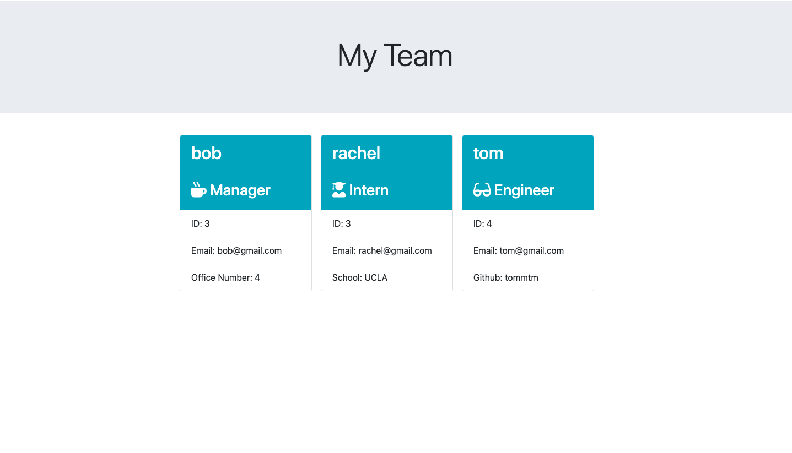
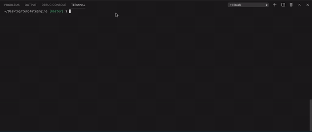

# Template Engine

This application allows a team manager to generate a webpage that displays their team's basic information through Node CLI. The application will prompt the user for information about the team manager as well as the team members. The user can choose to input as many members as they want, with a mix of engineers and interns. Once the user has entered all the members of their team, a HTML page with all the information provided by the user will be created. The application is also tested through Jest.



## Demo
run 'node index.js' in terminal




## Technologies Used

* [HTML](https://developer.mozilla.org/en-US/docs/Web/HTML): used for structuring and creating elements on the DOM
* [Bootstrap](https://getbootstrap.com/docs/4.4/getting-started/introduction/): CSS and Javascript framework for front-end web development
* [JavScript](https://developer.mozilla.org/en-US/docs/Web/JavaScript): used to create responsive, interactive elements on the page
* [Node.js](https://developer.mozilla.org/en-US/docs/Web/API/Node): Javascript runtime, allows users to run Javascript on the server
* [Inquirer NPM](https://www.npmjs.com/package/inquirer): Command Line Interface for Node.js
* [Jest](https://jestjs.io/): JavaScript testing framework

## Code Snippet

```
function initialQuestions() {
    inquirer.prompt([
        {
            type: "input",
            name: "name",
            message: "What is your manager's name?"
        },
        {
            type: "input",
            name: "id",
            message: "What is your manager's ID?"
        },
        {
            type: "input",
            name: "email",
            message: "What is your manager's email?"
        },
        {
            type: "input",
            name: "office",
            message: "What is your manager's office number?"
        }
        
    ]).then(function(response){
        const manager = new Manager(
            response.name, response.id, response.email,response.office
        )
        info.push(manager)
        whatType()
    })
}

function whatType(){
    inquirer.prompt([
        {
            type: "list",
            name: "type",
            message: "What type of team member would you like to add?",
            choices: ["Engineer", "Intern", "I dont want to add anymore team members"]
        }
    ]).then(function(response){
        if(response.type === "Engineer"){
            engineerQuestions()
        }
        else if(response.type === "Intern"){
            internQuestions()
        }
        else if(response.type === "I dont want to add anymore team members"){
            renderHTML(info)
        }
    })
}
```
This portion of the script file displays part of the inquirer prompts used to prompt the user for information. The function 'initialQuestions()' is called, which first prompts the user for information about the manager. That information is used to create a new object with all the listed methods in the class 'Manager', and this object is then pushed into an empty array named 'info', which will be later used to render the HTML page. The 'whatType()' function is run next, which will ask the user if they would like to enter information for another team member, and if they do, which kind. If the user chooses 'engineer', the function 'engineerQuestions()' will be run, which are inquirer prompts similar to 'initialQuestions()'. The same applies if the user chooses 'intern'. Once the user decides that they have entered every member in their team, they can decide 'I dont want to add anymore team members', and the renderHTML function will be run to create the final HTML page with all the information. 

## Authors

**Rachel Yeung**
* [Portfolio](https://rachelyeung.herokuapp.com/)
* [Github](https://github.com/xrachhel)
* [LinkedIn](https://www.linkedin.com/in/rachel-yeung-814986159/)

